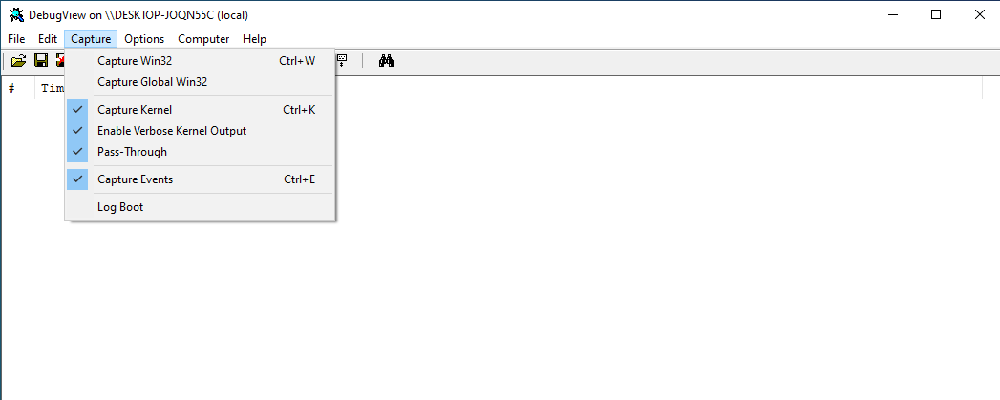
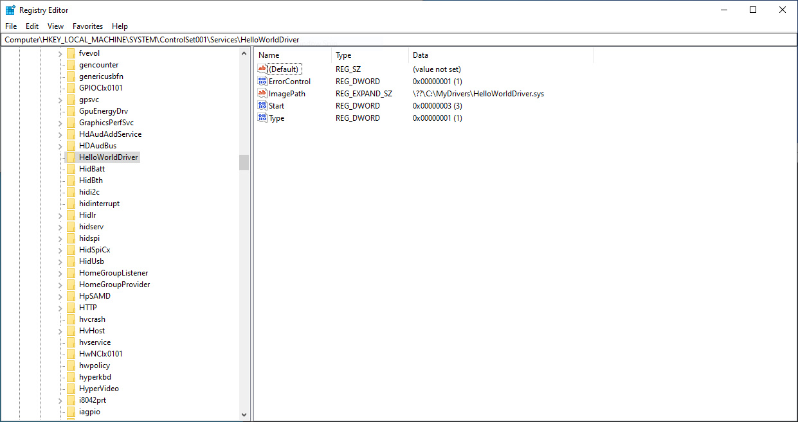
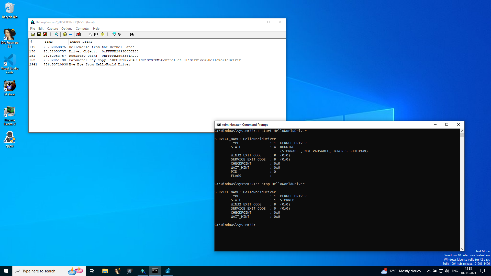

# HelloWorldDriver

This repository details how to start writing your first-ever Windows Driver. The main motivation for this has been to overcome the dread of venturing into the Kernel space and gradually learn Windows Kernel Exploitation techniques. 

## Prerequisite

For building and testing the Driver we need to have a couple of things:

-  Two Windows Machines: One to develop the driver on, and another to test it on (this better be a Virtual Machine)
- On the Development machine - follow the steps listed [here](https://learn.microsoft.com/en-us/windows-hardware/drivers/download-the-wdk) to have the right SDK and WDK.
- Have the `DebugView` tool from SysInternals on the Test Machine
- On the test machine, turn off Integrity checks and turn on test signing. This can be done by running the following commands from an Admin prompt and then rebooting the system:
```
bcdedit.exe -set loadoptions DISABLE_INTEGRITY_CHECKS
bcdedit.exe -set TESTSIGNING ON
```

## Creating A WDM Project

The first thing we need to do is to start a WDM project in Visual Studio:
- Open Visual Studio and Create a new Project
- Search the "Empty WDM Driver" template and select it

    

- Give your project the name you want and choose the location where you want to create it. For this example, I chose the name `HelloWorldDriver`
- You should have your template ready! 

    > Note that under `Driver Files`, you will find a file called `HelloWorldDriver.inf`, which can be used, with some tweaking, to install the resultant driver, but since we won't be installing the driver using it, feel free to get rid of it. 

- Finally, under the `Source Files`, add a `HelloWorld.c`file to store the Driver code.

    > Also, for this project, I would recommend setting Warning Levels to `Wall` instead of `W4` by going to Project Properties->C/C++->General->Warning Level

## Code Walkthrough

The code for the driver looks as follows:

```c
#include <ntddk.h>
#define DRIVER_TAG 'bdwh'

UNICODE_STRING g_RegPath;

void UnloadMe(PDRIVER_OBJECT);

NTSTATUS DriverEntry(PDRIVER_OBJECT DriverObject, PUNICODE_STRING RegistryPath) {
    DbgPrint("HelloWorld from the Kernel Land!\n");
    DbgPrint("Driver Object:\t\t0x%p\n", DriverObject);
    DbgPrint("Registry Path:\t\t0x%p\n", RegistryPath);

    // Allocate memory for variable
    g_RegPath.Buffer = (PWSTR)ExAllocatePool2(POOL_FLAG_PAGED, RegistryPath->Length, DRIVER_TAG);
    if (g_RegPath.Buffer == NULL) {
        DbgPrint("Error allocating memory!\n");
        return STATUS_NO_MEMORY;
    }

    // Copy Registry Path
    memcpy(g_RegPath.Buffer, RegistryPath->Buffer,RegistryPath->Length);
    g_RegPath.Length = g_RegPath.MaximumLength = RegistryPath->Length;
    DbgPrint("Parameter Key copy: %wZ\n", g_RegPath);

    // Unload Function
    DriverObject->DriverUnload = UnloadMe;
    return STATUS_SUCCESS;
}

void UnloadMe(PDRIVER_OBJECT DriverObject) {
    UNREFERENCED_PARAMETER(DriverObject);
    if (g_RegPath.Buffer != NULL) {
        ExFreePool(g_RegPath.Buffer);
    }
    DbgPrint("Bye Bye from HelloWorld Driver\n");
}
```

The PoC code outlines some basic concepts of Driver deployment including Memory Allocation, programming disciplines, etc. 

Start off with the _main_ function: `DriverEntry()`:

```c
NTSTATUS DriverEntry(PDRIVER_OBJECT DriverObject, PUNICODE_STRING RegistryPath) {
    DbgPrint("HelloWorld from the Kernel Land!\n");
    DbgPrint("Driver Object:\t\t0x%p\n", DriverObject);
    DbgPrint("Registry Path:\t\t0x%p\n", RegistryPath);

    // Allocate memory for variable
    g_RegPath.Buffer = (PWSTR)ExAllocatePool2(POOL_FLAG_PAGED, RegistryPath->Length, DRIVER_TAG);
    if (g_RegPath.Buffer == NULL) {
        DbgPrint("Error allocating memory!\n");
        return STATUS_NO_MEMORY;
    }

    // Copy Registry Path
    memcpy(g_RegPath.Buffer, RegistryPath->Buffer,RegistryPath->Length);
    g_RegPath.Length = g_RegPath.MaximumLength = RegistryPath->Length;
    DbgPrint("Parameter Key copy: %wZ\n", g_RegPath);

    // Unload Function
    DriverObject->DriverUnload = UnloadMe;
    return STATUS_SUCCESS;
}
```

Before we begin, there is one important thing to note:
- Usually when we write Userland code, the standard include files are: `Windows.h`, `stdio.h`, etc.
- Instead, for Drivers we include `ntddk.h` which defines the functions which we would be using in this PoC.

Moving onto the `DriverEntry()` function - it is analogous to the `main()` function and serves as an entry point to the driver. It is responsible for initializing the driver. The entry point function has a strict function definition: 

- It must return a `NTSTATUS` to indicate if the function succeeded or failed, and in case of the latter, also provide some information about the cause of the failure. 
- The function name: `DriverEntry`. If you are writing a driver in C++, make sure that the function name is not mangled.
- The function parameters:
    - `PDRIVER_OBJECT DriverObject`: A pointer to a `DRIVER_OBJECT` structure that represents the driver's WDM driver object. Detailing the individual members of the structure is beyond the scope of this blog, but we will discuss some of them as we come across them.
    - `PUNICODE_STRING RegistryPath`: A pointer to a UNICODE_STRING structure that specifies the path to the driver's Parameters key in the registry. The driver's Parameters key can contain configuration information for your driver.

Moving onto the main function body, we are first greeted with a bunch of `DbgPrint()` functions which look very similar to our good friend `printf()`, and to be honest, it mostly works the same except for floating points and some IRQL stuff (Read more [here](https://learn.microsoft.com/en-us/windows-hardware/drivers/ddi/wdm/nf-wdm-dbgprint)). Unlike `printf()` which prints to the console, The `DbgPrint()` routine sends a message to the kernel debugger. We use the `DbgPrint()` function to print the address of the function parameters. 

Next up, we move to the memory allocation part of the driver. In the driver code, we have a global variable `g_RegPath` of the type `UNICODE_STRING` where we would store a copy of the Parameter key aka the `RegistryPath` so that we can share it among other functions. This is similar to the times in User-mode programming when we allocate memory on the heap to share structures across functions. Whereas in user mode, we use good ol' `malloc()`, in DriverLand we have the `ExAllocatePool2()` function.

We need to allocate memory for the `Buffer` part of the global variable which is large enough to hold the corresponding buffer of the `RegistryPath` variable. The [`ExAllocatePool2()`](https://learn.microsoft.com/en-us/windows-hardware/drivers/ddi/wdm/nf-wdm-exallocatepool2) function allocates pool memory. The parameters of the function are as follows:
- `POOL_FLAG_PAGED` - The [`POOL_FLAG`](https://learn.microsoft.com/en-us/windows-hardware/drivers/kernel/pool_flags) which tells the function that we want the memory to be in a Paged Pool as we don't want it to live in the physical memory.
- `RegistryPath->Length` - Number of bytes to copy 
- `DRIVER_TAG` - The pool tag, aka a non-zero character literal of one to four characters delimited by single quotation marks (for example, `hwdb`), that is associated with a dynamically allocated chunk of pool memory and can be used to identify the source of Pool Memory leaks. It is something that has trickled down from the now-deprecated `ExAllocatePoolWithTag()` function. The string is usually specified in reverse order (for example, `bdwh`) - aka Little Endian. Each ASCII character in the tag must be a value in the range 0x20 (space) to 0x7E (tilde). Each allocation code path should use a unique pool tag to help debuggers and verifiers identify the code path.

And then, just like we do with `malloc()`, we check if the function failed, in which case it returns `NULL`, and if it did, we return `STATUS_NO_MEMORY`.

If the function succeeds, we fill out the `Length` and `MaximumLength` fields with the number of bytes in the buffer, use `memcpy()` to copy over the bytes to the allocated memory space, and use `DbgPrint()` with the `%wZ` format specifier to print out the copied string.

There is one final step before we exit: specifying an unload routine. Remember the `DriverObject` variable? It has a member called `Unload` which takes the address to a function that would be called when the driver is being unloaded. This allows us to perform some cleanup operations to prevent BSODs and deallocate any dynamic memory. Finally, we exit with `STATUS_SUCCESS`.

However, this is not the end. We still have the unload routine. The unloading routine for our driver looks like this:

```c
void UnloadMe(PDRIVER_OBJECT DriverObject) {
    UNREFERENCED_PARAMETER(DriverObject);
    if (g_RegPath.Buffer != NULL) {
        ExFreePool(g_RegPath.Buffer);
    }
    DbgPrint("Bye Bye from HelloWorld Driver\n");
}
```

The function definition for unload routines is also very strict. While the function name can vary, the rest of the function header should remain the same. Unload routines return nothing (understandably) and they only take in a pointer to the driver object.

Since we do not use the pointer to the `DriverObject`, we use the `UNREFERENCED_PARAMETER` macro to get rid of the `C4100` warning, aka the Unused Variable warning. Next up, we check if the buffer we allocated is `NULL` or not, if not, we go ahead and free the memory using `ExFreePool()`, just like we do with `free()`. I would like to add one note here - try to be as paranoid as you can while writing Drivers. For example, even if we skip the `NULL` checks here, we do not even get any warning, but we still do because the memory might have been freed somewhere else (especially in larger code bases), so it is good to put checks in place to prevent a Double-Free like situation and cause a BSOD. 

## Compiling 

We can easily compile the code using Visual Studio build options. Sticking to debug builds for now, we should have two files at the end of the build: 
-  HelloWorldDriver.pdb: The Debug symbols for the driver
-  HelloWorldDriver.sys: The actual driver

Copy these over to the target machine where we would be testing the driver and follow along. 

## Installing Driver

To install custom drivers, there are special functions for that. See [CmRegisterCallback()](https://learn.microsoft.com/en-us/windows-hardware/drivers/ddi/wdm/nf-wdm-cmregistercallback?redirectedfrom=MSDN), [CmRegisterCallbackEx()](https://learn.microsoft.com/en-us/windows-hardware/drivers/ddi/wdm/nf-wdm-cmregistercallbackex?redirectedfrom=MSDN) and [Filtering Registry Calls](https://learn.microsoft.com/en-us/windows-hardware/drivers/kernel/filtering-registry-calls?redirectedfrom=MSDN) on MSDN.

However, we can use the `Service Controller` binary(`sc.exe`) to do just that. Firstly, we need to create a Kernel-mode service with:

```
sc create HelloWorldDriver type= kernel binPath= C:\MyDrivers\HelloWorldDriver.sys
```

> Note: The spaces after `type= ` and `binPath= ` are not a typing error, they MUST be there if the command is to run successfully.

The above command creates a kernel service with the name `HelloWorldDriver` which loads the driver located at `C:\MyDrivers\HelloWorldDriver.sys`.

Now, load up `DebugView` with Admin privileges with 
and under the `Capture` tab, have the shown options selected. 



Once the event capture is on, we can start the driver with:
```
sc start HelloWorldDriver
```

This should start our driver and we should see the `DbgPrint()` statements pop up in the `DebugView` Window.


Noticing the output in the `DebugView` we see a path to a registry key. Opening the path in the registry editor, we are greeted with this:



These registry options can be used to control the behavior of the Driver. 

Finally, we can unload the driver with:
```
sc stop HelloWorldDriver
```



As soon as we unload the driver, we again get to see the message from the Unload routine in the `DebugView()` window. 

Thus, we finally loaded and unloaded our first Windows Driver yay!

## Conclusion

I know this blog/repo is like the literal `Hello World!` of Driver programming and there is still a lot to cover - including setting up Debuggers, advanced drivers, etc. In this blog post, I have tried to provide a very gentle introduction to Windows Driver Development and I will be following up with more posts on related topics in the future. Till next time, see you space cowboy. 

